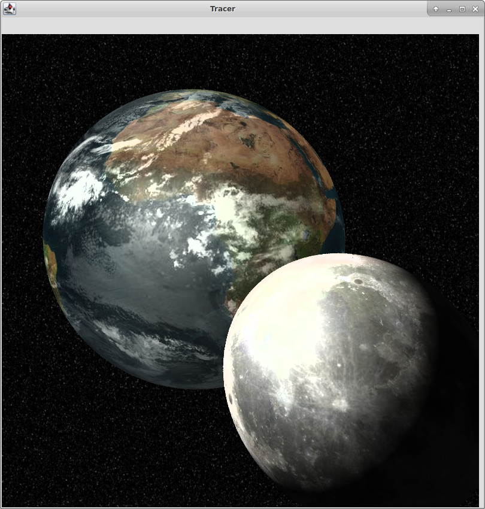

Raytracer
=========



A simple raytracer with support for primitives, anti-aliasing, refraction, and Perlin noise.
Collaborative work with [Jeffrey Resodikromo](linkedin.com/in/jeffrey-resodikromo-42503b97).
The program by defaults reads from a scene file called `scene.txt`.

To run as a JAR from the `bin/` folder:
```bash
$ java -jar raytracer.jar
```
